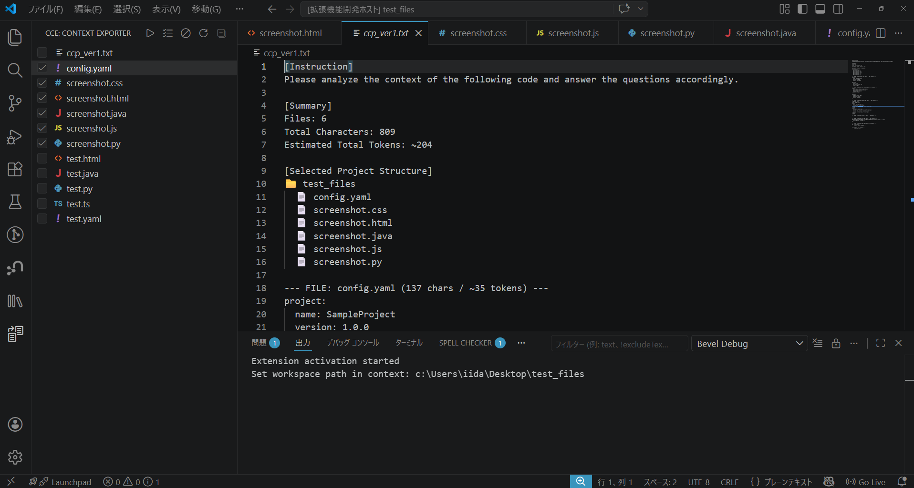
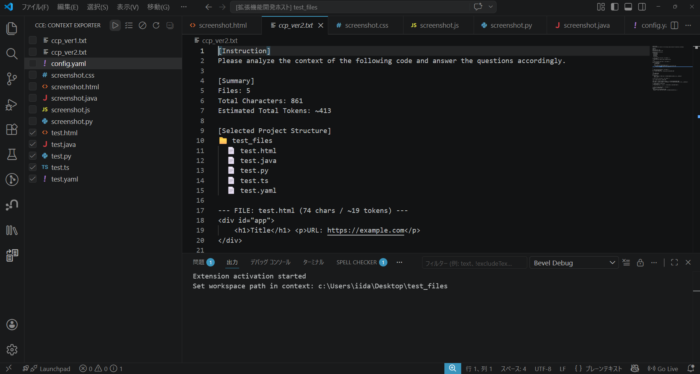
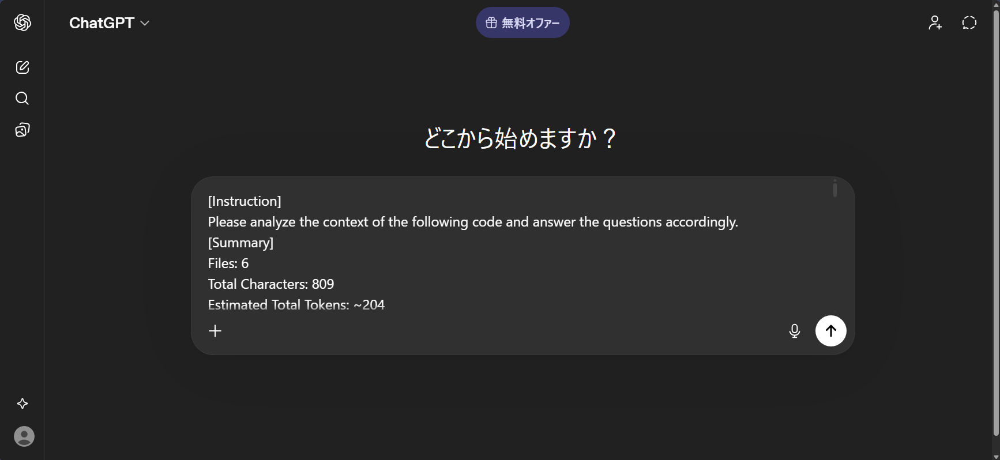

# Code Context Exporter (CCE)

---

# 🇺🇸 English

## Overview

Code Context Exporter (CCE) is a VSCode extension that collects selected files and exports them into a single structured text optimized for AI interaction.

It is primarily intended to provide full code context for AI prompts, while also supporting future development as a tool that helps AI or humans understand large and complex codebases.

Currently, the output template for AI prompts is fixed. Future updates will allow users to edit the template and toggle its use.

---

## What's New (v0.0.3)
* **Fixed:** Resolved an issue where the "Clear All" button in the sidebar was not functioning.
* **Improved:** Enhanced state synchronization between the UI and internal file selection.

---

## Features

* Select files via tree view
* Export project structure + file contents
* Token & character estimation
* Binary / large file auto-skip
* Structured output optimized for AI prompts (template currently fixed)

---

## Usage

1. Open the **CCE** sidebar
2. Select files using checkboxes
3. Click **Generate Prompt**
4. A combined output file is generated in your workspace

---

## Output Format

```
[Instruction]
...

[Summary]
Files: X
Estimated Tokens: ~XXXX

[Selected Project Structure]
📁 src
  📄 index.ts

--- FILE: src/index.ts ---
...
```

---

## Use Cases

* Providing full context to AI tools
* Debugging with complete code visibility
* Saving project snapshots
* Submitting assignments as a single file
* Code review and documentation

---

## Design Philosophy

This tool prioritizes explicit user control over automatic filtering.

Instead of relying heavily on .gitignore, users decide what to include.

The tool is designed to evolve into a utility that helps AI or humans understand large and complex code.

Planned high-priority updates:

* Template editing for AI prompts
* Toggle AI template usage on/off

Other planned features remain lower priority: comment removal, file type filtering, token optimization, optional .gitignore integration, selection presets.

---

## Branch Strategy

This repository uses separate branches:

* `main` → development branch (may include experimental features)
* `release/v0.1` → stable version for marketplace publishing

---

## Naming Note

This project was originally named **CCP (Code Context Protocol)**.
Some internal identifiers (commands, variables) still use `ccp`.

---

## Contributing

Feel free to fork this project and build your own variations.

---

## License

MIT License

This project is open-source and can be freely used, modified, and redistributed.

---

# 🇯🇵 日本語

## 概要

Code Context Exporter (CCE) は、VSCode上で選択した複数ファイルを
AIに渡しやすい形式で1つのテキストにまとめる拡張機能です。

主にAI向けのプロンプト用途を想定しており、現在はテンプレートが 固定 されています。
将来的には、テンプレートの 編集 や オンオフ切替 が可能になることを最優先で開発予定です。

また、AIや人間が巨大で複雑なコードを理解する助けになるツールへ発展させることも目指しています。

---

## 更新履歴 (v0.0.3)
* **不具合修正:** サイドバーの「すべて外す」ボタンが機能していなかった問題を修正しました。
* **改善:** UIのチェック状態と内部データの同期精度を向上させました。

---

## 主な機能

* ツリービューからファイル選択
* プロジェクト構造＋ファイル内容の出力
* トークン数・文字数の推定
* バイナリ・巨大ファイルの自動除外
* AIプロンプト向けの整形出力（テンプレートは現在固定）

---

## 使い方

1. サイドバーの **CCE** を開く
2. ファイルをチェックで選択
3. **Generate Prompt** をクリック
4. ワークスペースに出力ファイルが生成されます

---

## 出力形式

```
[Instruction]
...

[Summary]
Files: X
Estimated Tokens: ~XXXX

[Selected Project Structure]
📁 src
  📄 index.ts

--- FILE: src/index.ts ---
...
```

---

## 想定用途

* AIにコード全体を解析させる
* 文脈付きでのデバッグ
* プロジェクトのスナップショット保存
* 課題提出用に1ファイル化
* コードレビューやドキュメント化

---

## 設計思想

本ツールは 自動除外よりも明示的な選択 を重視しています。

.gitignoreには完全には依存せず、ユーザーが何を出力するか決定します。

将来的には、AIや人間が巨大で複雑なコードを理解する助けになるツールへ発展させることを目指しています。

最優先の今後の開発予定:

1. AIテンプレートの編集機能
2. AIテンプレートのオンオフ切替

その他の予定機能（コメント削除、拡張子フィルタ、トークン最適化、.gitignore連携、選択状態の保存）は優先度が低めです。

---

## ブランチ運用

本リポジトリでは以下のブランチを使用しています：

* `main` → 開発用（実験的機能を含む可能性あり）
* `release/v0.1` → 公開用の安定版

---

## 命名について

本プロジェクトは元々 **CCP (Code Context Protocol)** として設計されており、
内部コードでは現在も `ccp` という識別子が使用されています。

---

## コントリビューション

フォーク・改変・再公開など自由に行っていただいて構いません。

---

## ライセンス

MIT License

本ソフトウェアは自由に利用・改変・再配布が可能です。


## Screenshots

### Export Codes 1


### Export Codes 2


### AI Prompt Example
